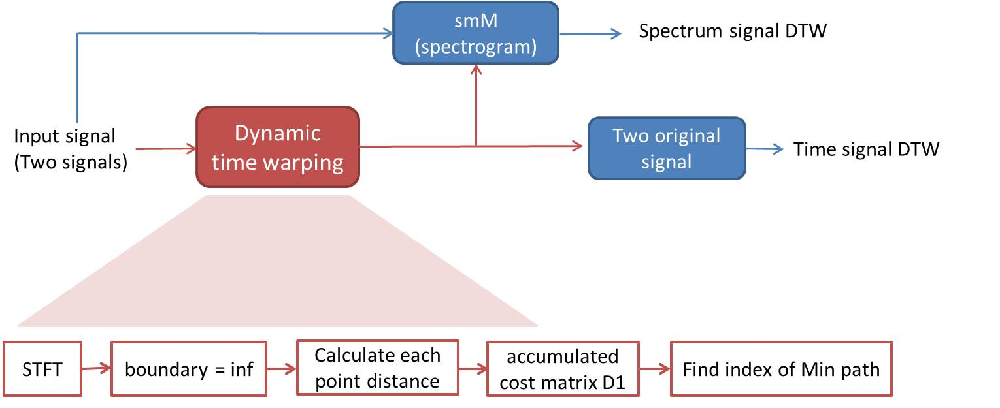
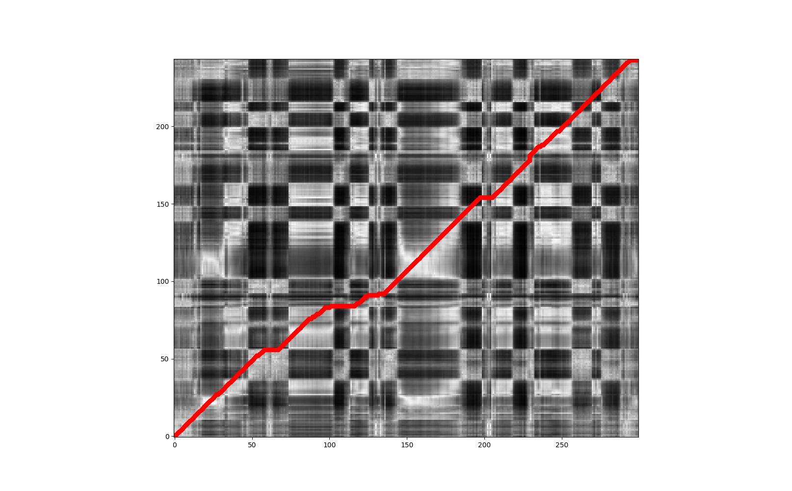

# Project 2: Dynamic Time Warping (DTW)

## Overview
The goal of this assignment is that finding the similar part of two signal, then connecting the similar part by lines. Here we use the Dynamic Time Warping method to find the similarities. 

## Demo
1. voice: using two voice in data including sm1_cln.wav and sm2_cln.wav
2. DTW: using *demo_dtw_st.py* to find the similarities of two signal
3. **I reference from here: https://github.com/pierre-rouanet/dtw**

## Result
**1. DTW Flow**

 

**2. Result - Fequency domain**
* The horizontal and vertical are both signal, white part means the two signal is close and black  means the two signal is not close.
* Red line means the closest point for two signal.
<table border=1>
<tr>
<td>

</td>
</tr>

</table>

**3. Result - Time domain**
* Using red lines to connect similarities of two signals.
<table border=1>
<tr>
<td>

</td>
</tr>

</table>

## Requirements
* librosa
* numpy, scipy, matplotlib
