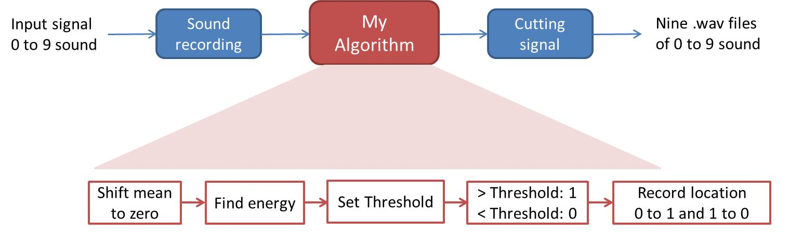
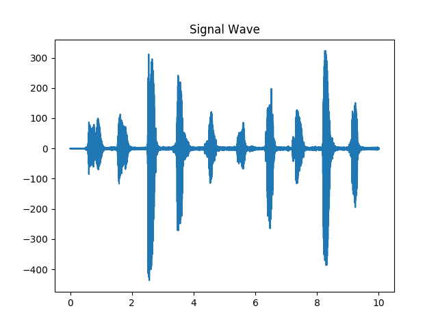
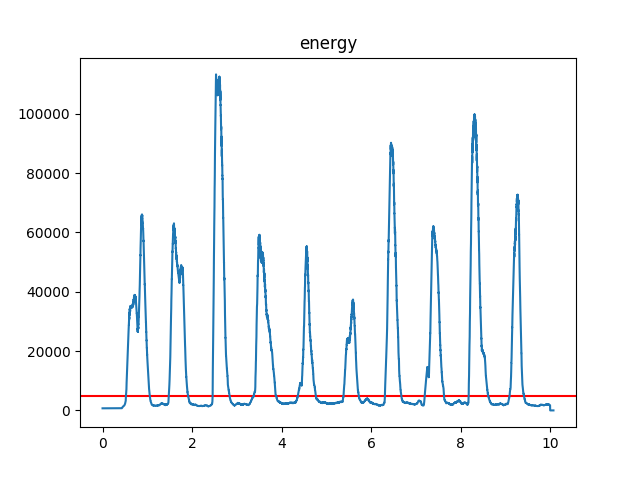
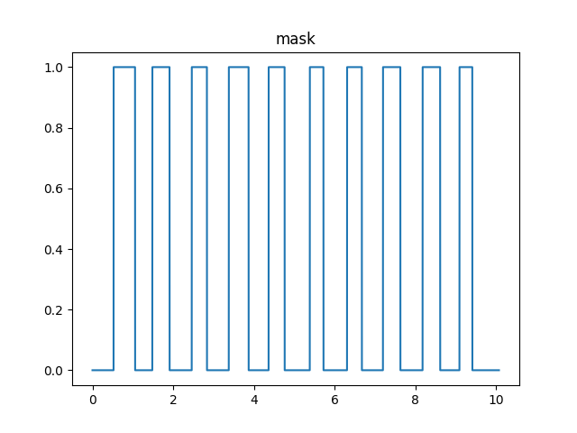
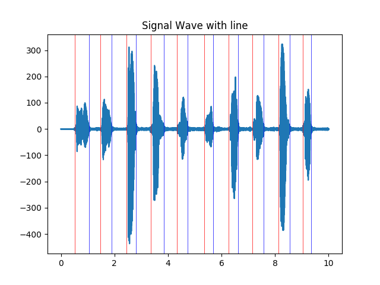

# Project 0: Energy-based Voice Activity Detection

## Overview
The goal of this assignment is detection the voice, whether is sound at that time or not. First, we need to record our voice. Here I record the voice from 0 to 9 or using sample_audio.wav. Second, using your Energy-based Voice Activity Detection(VAD) Algorithm to detect where is the voice start and where is voice end. Finally, by your detection, You cut the signal into 10 file, which is voice from 0 to 9.

## Demo
1. Record our voice: using *record.py* to record our voice into .wav file or using sample_audio.wav
2. Energy-based Voice Activity Detection(VAD) Algorithm: using *sample.py* or *my.py* to do the VAD (need set Threshold carefully)
3. Cut the signal: Cutting your signal by VAD, using *cut.py*

&emsp;**[Other]**  
&emsp;&emsp;(1). test each signal you cut: using *test.py* to test the signal you cut  
&emsp;&emsp;(2). play the voice: using *play.py* to play the signal

## Result
**1. My VAD Algorithm flow**

 

**2. Example of my voice**
<table border=1>
<tr>
<td>

</td>
</tr>

</table>

## Requirements
* Pyaudio
* numpy
