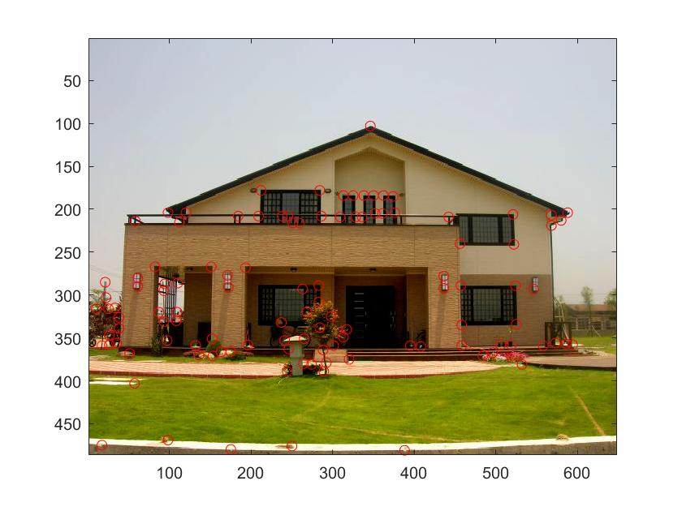
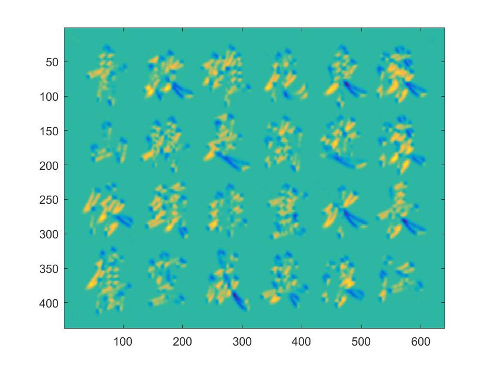
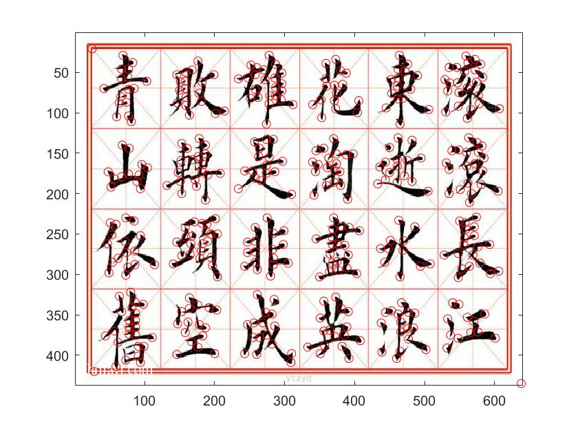

# 鄭敬儒<span style="color:red">_103061240</span>

# Project 2 / Image Filtering and Corner Detection

## Overview
> 這個project的目標是實作 Corner Detection。這裡實作 Corner Detection 使用的方法為 Harris Corner Detector。將任何一張Image作為Input，經過Harris Corner Detector後，可測出照片中多數的corners，並將所有測得的cornors用紅色圓圈給標示出來。


## Implementation
1. 實作Harris Corner Detector：MyHarrisCornerDetector.m
	* 這個部分的實作分為五步驟。首先是將Image給讀入，得知其size。<br>參考網站1: https://www.slideshare.net/Sheenum/harris-method <br>參考網站2: http://www.cse.psu.edu/~rtc12/CSE486/lecture06.pdf
	* (1) 由Taylor Series for 2D Functions可以導出Harris Detector的數學型式。接著要由這個數學型式把Harris Detector表達出來。
	<br>(1-1)先求Ix,Iy，目的是要獲得Image x,y 方向的derivatives。因為只能求2D convolution，所以我把其中一個channel取出來運算。
	<br>(1-2)再來要得 H = [[Ix2 Ixy];[Iyx Iy2]]，所以計算Ix2, Iy2, Ixy，目標是得到products of derivatives at every pixel。
	<br>(1-3)此三項需經一個w(x,y)，這裡為Gaussian，這個部分的目的為Compute the sum of product of derivatives at each pixel。
	  ```
	  % calcualte Ix, Iy
	  % get image gradient
	  I = I(:,:,1);
	  Ix = conv2( I,dx, 'same');
	  Iy = conv2( I,dy, 'same');
	  
	  % calculate Ix2, Iy2, Ixy
	  % get all components of second moment matrix M = [[Ix2 Ixy];[Iyx Iy2]]; note Ix2 Ixy Iy2 are all Gaussian smoothed
	  Ix2 = conv2((Ix.^2),g,  'same');
	  Iy2 = conv2((Iy.^2),g,  'same');
	  Ixy = conv2((Ix.*Iy),g,  'same');
	  
	  ```
	* (2)定義each pixel (x,y), the H matrix。並且計算response of the detector at each pixel。在得到每個pixel的response後，把R的最大值訂為1000。
	  ```
	  % get corner response function R = det(M)-alpha*trace(M)^2
	  for x=1:xmax,
   	    for y=1:ymax,
     	    H = [Ix2(x, y) Ixy(x, y); Ixy(x, y) Iy2(x, y)];
     	    R(x,y) = det(H) - alpha * (trace(H) ^ 2);
  	    end
	  end
	  
	  % make max R value to be 1000
	  R=(1000/max(max(R)))*R;
	  
	  ```
	* (3)藉由 ordfilt2(R, sze.^2, ones(sze)) 來找 ones(sze)內最大的值。
	  ```
	  % using B = ordfilt2(A,order,domain) to complment a maxfilter
	  sze = 2*r+1; % domain width 
	  
	  % calculate MX
	  MX = ordfilt2(R, sze.^2, ones(sze));
	  
	  ```
	* (4)由(3)所找到局部最大的值和自己所訂的Thrshold，來找R中那些點是需要的，此處為RBinary。
	  ```
	  % find local maximum.
	  % calculate RBinary
	  RBinary = (R == MX) & (R > Thrshold);
	  
	  ```
	* (5)藉由(4)所找出的RBinary，來獲取corner points的位置。同時把 image edge 的點去除。
	  ```
	  % get location of corner points not along image's edges
	  % How many interest points, avoid the image's edge
	  offe = r-1;
	  count=sum(sum(RBinary(offe:size(RBinary,1)-offe,offe:size(RBinary,2)-offe))); 
	  
	  % get location of corner points
	  R=R*0;
	  R(offe:size(RBinary,1)-offe,offe:size(RBinary,2)-offe)=RBinary(offe:size(RBinary,1)-offe,offe:size(RBinary,2)-offe);
	  [r1,c1] = find(R);
	  
	  ```
	* 最後從找到的 [r1,c1]，把測到的corner points畫在原圖上。
	
## Installation
* Other required packages. No
* How to compile from source? I download to my laptop and compile on MatLab

### Results
> Here will show Ixy and result of Harris Corner Detector

1. House
<table border=1>
<tr>
<td>



</td>
</tr>

</table>


2. Chinese
<table border=1>
<tr>
<td>


</td>
</tr>

</table>

