# 鄭敬儒<span style="color:red">_103061240</span>

# Project 1 / Image Filtering and Hybrid Images

## Overview
> 這個project的目標是實作Hybrid Images。首先實作一個2D convolution for color image，且圖片大小不會改變，並使用各種filter來測試convolution運算正確；接著藉由2D convolution，將兩張照片分別經過low pass filter and high pass filter進行2D convolution運算；
最後將經過low pass filter和high pass filter的結果疊加在一起，便可以得到目標：Hybrid Images！


## Implementation
1. 實作2D convolution：my_imfilter.m
	* 讓 Input and Output 的 image size 一樣
	  此處我的作法為 zero padding。 下方的code中，height_i, width_i, channel_i 表示input image的長寬和channel數，height_f, width_f 表示 
	  filter的長寬。其中 (width_i-width_f+1) 和 (height_i-height_f+1) 代表padding前做convolution時，filter在兩個維度上的移動量。也就是
	  output image size的大小(會縮小)。 再用原圖大小 height_i, width_i 去扣output size就是要padding的量，因為目標是原圖和output的size要相
	  同。 而除以2是代表padding在上下和左右個別的量。
	  
	* 用padarray()來把input image的每個channel做padding。padarray(image,[pad_h pad_w],0,'both')意義為，對image每個channel做padding，
	padding在上下的量為pad_h, 左右的量為pad_w，然後padding 0，'both'為上下左右都要pad。

	
	  ```
	  %padding part
	  
	  %filter size and image size
	  [height_f, width_f] = size(filter);
	  [height_i, width_i, channel_i] = size(image);
	  
	  %zero padding
	  pad_w = (width_i - (width_i-width_f+1))/2; 
	  pad_h = (height_i - (height_i-height_f+1))/2;
	  pad_image = padarray(image,[pad_h pad_w],0,'both');
	  
	  ```
	
	* 利用3個for loop來實作2D convolution for color images，w,h兩個維度分別表示長寬，而z則表示RGB三個channel，
	  image和filter做點對點相乘，再sum起來
	  ```
	  %convolution part
	  %padding size and initializing output
	  [height_p, width_p, channel_p] = size(pad_image);
	  output = zeros(height_i, width_i, channel_i);
	  
	  %convolution
	  x_run = width_p-width_f+1;
	  y_run = height_p-height_f+1;
	  for w = 1 : x_run
	      for h = 1 : y_run
              for z = 1 : channel_p
                    a = h+height_f-1;
                    b = w+width_f-1;
                    value = dot(pad_image(h:a, w:b, z), filter);
                    output(h,w,z) = sum(value);
              end
	      end
	  end
	  
	  ```
	  

2. 實作Hybrid Images：proj1.m
	* 利用my_imfilter和Gaussian filter，製作出image1的low_frequencies圖片
	  接著用相同手法製作出image2的low_frequencies圖片，並用image2 - low_frequencies，便可得到high frequency部份。
	  最後再將low_frequencies和high frequency圖片相加，即可得到Hybrid Images。有時候high frequency部份會太顯著，導致即使圖片很小，high 
	  frequency的部分依然很明顯，因此我會對某些high frequency太過顯著的圖乘上一個小於1的值來下降他的效果。
	  
	  
	  ```
	  low_frequencies= my_imfilter(image1, filter);
	  high_frequencies= image2 - my_imfilter(image2, filter);
	  hybrid_image=high_frequencies+low_frequencies;
	  ```
	 
## Installation
* Other required packages? 
    No
* How to compile from source?
    I download to my laptop and compile on MatLab


### Results
1. proj1_test_filtering.m 來testing my_imfilter.m的圖
	* 第一個row由左至右，依序為identity_image, blur_image, large_blur_image
	* 第二個row由左至右，依序為sobel_image, high_pass_image, laplacian_image
<table border=1>
<tr>
<td>


</td>
</tr>

<tr>
<td>
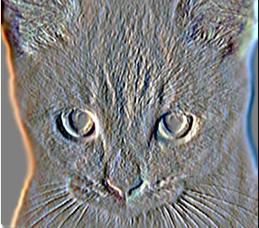
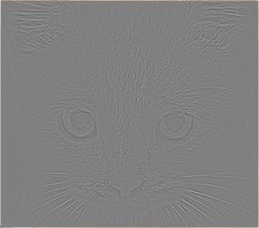
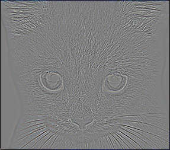
</td>
</tr>

</table>


2. dog: low frequency ； cat: high frequency 
<table border=1>
<tr>
<td>


</td>
</tr>

<tr>
<td>

</td>
</tr>

</table>


3. fish: low frequency ； submarine: high frequency 
<table border=1>
<tr>
<td>

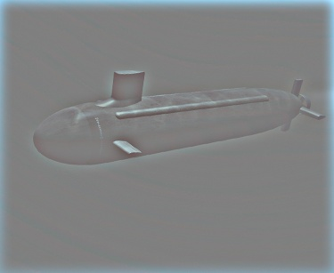
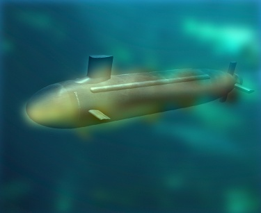
</td>
</tr>

<tr>
<td>

</td>
</tr>

</table>


4. 地瓜: low frequency ； bomb: high frequency (* 0.6)
<table border=1>
<tr>
<td>
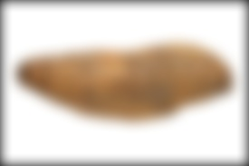
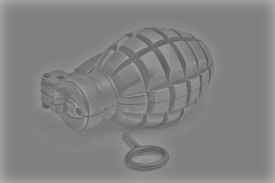
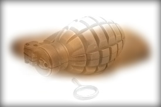
</td>
</tr>

<tr>
<td>
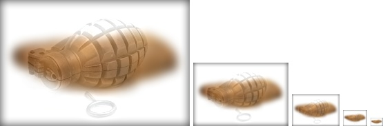
</td>
</tr>

</table>


5. 皮卡丘: low frequency ； 李奧納多: high frequency (* 0.4)
<table border=1>
<tr>
<td>
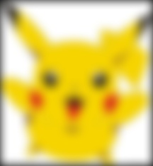
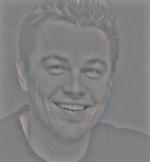
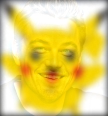
</td>
</tr>

<tr>
<td>
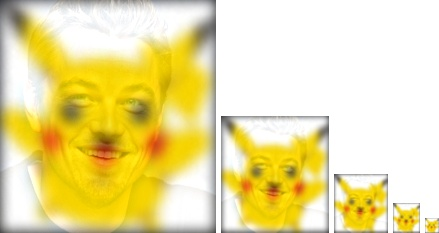
</td>
</tr>

</table>
