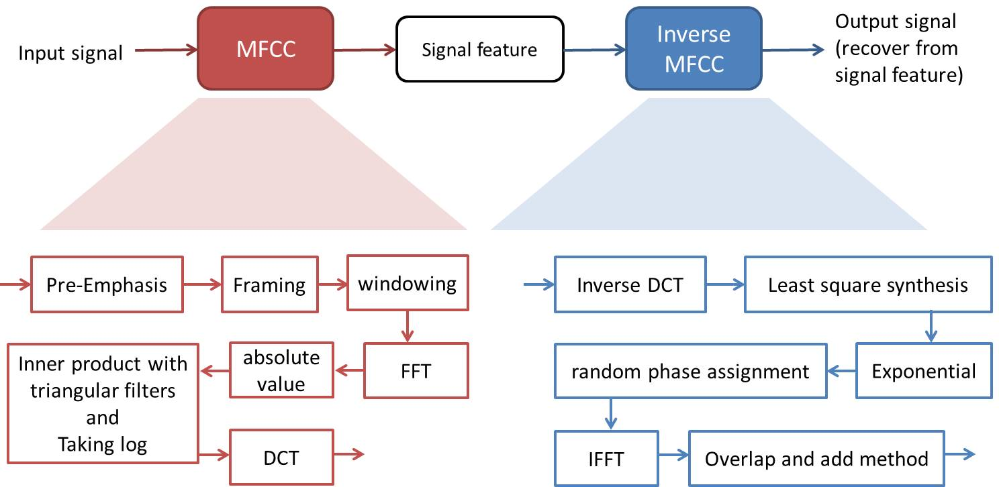
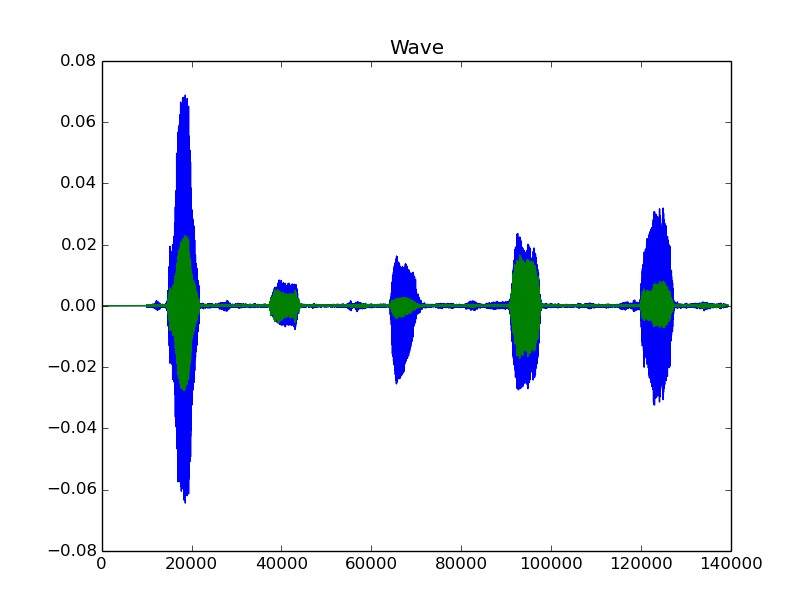
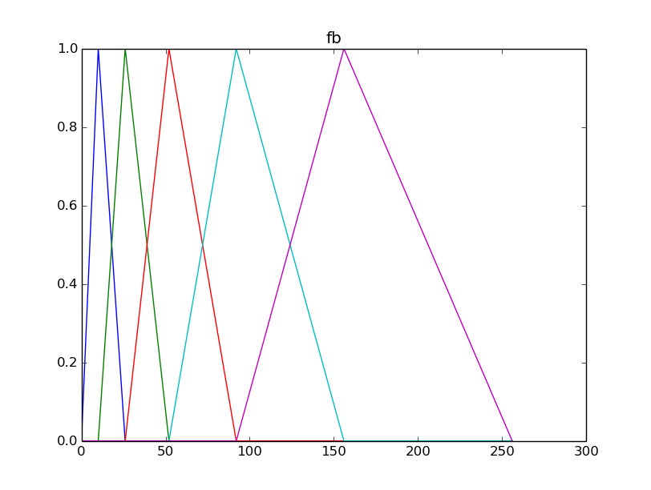
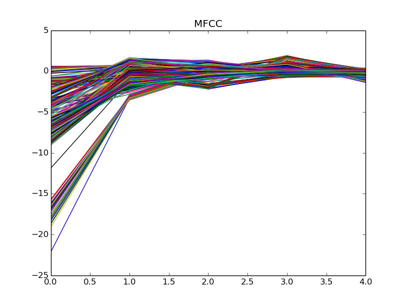

# Project 1: Mel-Frequency Cepstral Coefficient (MFCC)

## Overview
The goal of this assignment is that finding the singal feature from input and recontructing the signal feature to original signal. Here we use the Mel-Frequency Cepstral Coefficient(MFCC) to find the singal feature, then using Inverse MFCC to recontruct the input signal from signal feature.

## Demo
1. Record our voice: using *record.py* to record our voice into .wav file or using SteveJobs.wav
2. MFCC and Inverse MFCC: using *MFCC.py* to find the feature of voice, then recructing it and storing into a .wav file

## Result
**1. MFCC and Inverse MFCC flow**

 

**2. Example of my voice**
* "wave" is original signal(blue) and pre-emphsis signal(green)
* "fb" is triangular filter using in MFCC process
* "MFCC" is signal feature of input
<table border=1>
<tr>
<td>

</td>
</tr>

</table>

## Requirements
* Pyaudio
* soundfile
* numpy, scipy, matplotlib
