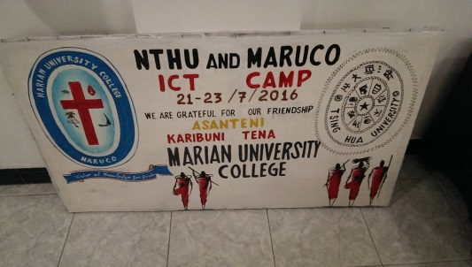

# 鄭敬儒<span style="color:red">_103061240</span>

# DSP Lab HW0 / Image Flipping and Rotating

## Overview
> 這個Lab目標是要實作出Image flipping和Image rotating。Image flipping的部分，實作一個flip.m的function，可以依據輸入進function的值來選擇flip的模式，在這裡可以將圖片做水平、垂直、水平+垂直的3種翻轉。Image rotating的部分，實作一個rotation.m的function，同樣可以依據輸入進function的值來選擇rotate的角度。以上述兩個function來完成Image flipping和Image rotating。


## Implementation
1. Image flipping
	* 這個部分的實作分為三步驟，(1)首先是將Image讀入，得知其size，同時將input image分成RGB三個channel，然後initialize flipping完的image之三個channel(R_flip、G_flip、B_flip)的大小，三個size皆是input image的 width* height，並且都先initialize為0。
	* (2)用兩個for loop來做翻轉。我以水平翻轉為例，當for loop在固定為某個height時，把原圖(height, width)地方的值，assign到翻轉後(height, 1)地方的值，對三個channel都這麼做便可以進行水平翻轉，垂直翻轉作法類似。水平+垂直翻轉作法也相同，可見下方code。
	* (3)將R_flip、G_flip、B_flip分別assign到ouput(I_flip)的三個channel。另外，最後要將output丟入uint8()的function，否則圖片會是白白的一片，理由應該是照片讀入後，經過處理時會變成double的形式，要轉回int，也就是0-255才會顯示出不是一片白的照片。參考網址：https://www.mathworks.com/matlabcentral/answers/88934-images-don-t-show-with-imshow-after-converting-them-to-double

	  ```	
	  % horizontal+vertical flipping
	  for h = 1 : height
	      for w = 1 : width 
	          R_flip(h, w) = R(height-h+1, width-w+1);
	          G_flip(h, w) = G(height-h+1, width-w+1);
	          B_flip(h, w) = B(height-h+1, width-w+1);
	      end
	  end
	  
	  % save R_flip, G_flip, B_flip to output image
	  I_flip(:,:,1) = R_flip;
	  I_flip(:,:,2) = G_flip;
	  I_flip(:,:,3) = B_flip;
	  I_flip = uint8(I_flip);
	  
	  ```

2. Image rotating
	* 這個部分的實作分為七大步驟。首先當然是把Image讀入，得知其size，同時將input image分成RGB三個channel。
	* (1)訂原始照片的四個頂點座標，我這裡令4個點為(1,1),(width,1),(1,height),(width,height)並將其合併成一個2x4的矩陣。再來將其乘上一個選轉矩陣，得到旋轉後的四個頂點座標。
	  ```
	  % step1. record image vertex, and use rotation matrix to get new vertex.
	  matrix = [cos(radius) -sin(radius) ; sin(radius) cos(radius)];
	  vertex = [1 width 1 width ; 1 1 height height];
	  vertex_new = matrix*vertex;
	  ```
	* (2)用min(), max()來找旋轉後頂點的x,y最大最小值，目的是要找出旋轉後Image的大小。
	  ```
	  % step2. find min x, min y, max x, max y, use "min()" & "max()"
 	  min_x = min(vertex_new(1,:));
 	  min_y = min(vertex_new(2,:));
 	  max_x = max(vertex_new(1,:));
 	  max_y = max(vertex_new(2,:));
	  ```
	* (3)再來要找shifting的值，目標是要讓旋轉後的照片，所有的pixel都在positive axis上。此處我是希望shifting完，x,y最小的值會是在"1"上，這裡我以x為例，當(min_x <= 0)時，那麼就要往右shift到"1"，所以shifting值為(-min_x+1)；當(min_x > 0)時，那麼就要往左shift到"1"，所以shifting值也為(-min_x+1)。
	  ```
	  % step3. consider how much to shift the image to the positive axis
	  if min_x <= 0
	      x_shift = -min_x+1;
	  end
	  if min_x > 0
	      x_shift = -min_x+1;
	  end
	  ```
	* (4)算Rotating完的Image大小，也就是把(2)的x,y最大最小值拿來相減，便可以得到旋轉後的Image大小。但因為旋轉後的點會有小數值，但image pixel不應該有小數值，所以用ceil()進位，floor()捨去，來對max做ceil()和對min做floor()，這樣進位捨位才不會切到rotating完的圖。
	  ```
	  % step4. calculate new width and height
	  width_new = ceil(max_x) - floor(min_x);
	  height_new = ceil(max_y) - floor(min_y);
	  ```	
	* (5)將(4)算出來的height_new和width_new，來initialization旋轉後圖片RGB三個channel的大小。
	* (6)Back-warping using bilinear interpolation來求旋轉後各個點的value值。此處分為6個小步驟。(6-1)把rotation完的圖片的每個pixel，反方向shift回去，再反向旋轉回去，這麼做便有機會找到原圖的某個點，該點就是旋轉後那點的value值，但是這樣逆向操作，可能會找到原圖中的非整數點，因此之後幾個步驟會做interpolation，來從鄰近的四個點找值。
	  ```
	  % step6-1. shift the new pixel (x_new, y_new) back, and rotate -radius
	  matrix_n = [cos(-radius) -sin(-radius) ; sin(-radius) cos(-radius)];
	  x_n = x_new - x_shift;
	  y_n = y_new - y_shift;
	  new = matrix_n*[x_n ; y_n];
	  x_old = new(1);
	  y_old = new(2);
	  ```
	* (6-2)找出逆向操作後的鄰近4個點
	  ```
	  % step6-2. using "ceil()" & "floor()" to get interpolation coordinates
	  x2 = ceil(x_old);
	  x1 = floor(x_old);
	  y2 = ceil(y_old);
	  y1 = floor(y_old);
	  ```
	* (6-3)如果逆向操作的點在原始圖片內那麼就做interpolation，如果沒有就令為0。
	  ```
	  % step6-3. if (x_old, y_old) is inside of the source image, calculate r,g,b by interpolation.
	  % else if (x_old, y_old) is outside of the source image, set r,g,b = 0(black). 
	  if ((x1 >= 1) && (x1 <= width) && (x2 >= 1) && (x2 <= width) && (y1 >= 1) && (y1 <= height) && (y2 >= 1) && (y2 <= height))
	      %DOING INTERPOLATION HERE
	  else
	    r = 0;
	    g = 0;
	    b = 0;
	  ```
	* (6-4)再來做interpolation，這裡要找出鄰近四個點的權重值。找法如此圖所示：https://github.com/Ching-Ju-Henry/DSP_Lab_HW0/blob/master/files/fig3.png 。先處理分母為0的狀況，也就是x1=x2或y1=y2的情形，這裡我把權重皆設為0.5。同時也計算非上述情況的權重值。
	  ```
	  % step6-4. calculate weight wa, wb. Notice that if x1=x2 or y1=y2
	  if (x1==x2)
	      wa = 0.5;
	  end
	  if (y1==y2)
	      wb = 0.5;
	  end
	  if (x1 ~= x2) && (y1 ~= y2)
	      wa = (x_old-x1)/abs(x2-x1);
	      wb = (y_old-y1)/abs(y2-y1);
	  end
	  ```
	* (6-5)計算鄰近4個點的權重值
	  ```
	  % step6-5. calculate weight w1, w2 w3, w4 for 4 neighbor pixels. 
	  w1 = (1-wa).*(1-wb);
	  w2 = wa.*(1-wb);
	  w3 = wa.*wb;
	  w4 = (1-wa).*wb;
	  ```
	* (6-6)把對應的權重值乘上相鄰的pixel值，便可以得到逆向操作後該點的值，也就是旋轉後某點的數值。
	  ```
	  % step6-6. calculate r,g,b with 4 neighbor point and their weight
	  r = (R(y1,x1)*w1 + R(y2,x1)*w2 + R(y2,x2)*w3 + R(y1,x2)*w4);
	  g = (G(y1,x1)*w1 + G(y2,x1)*w2 + G(y2,x2)*w3 + G(y1,x2)*w4);
	  b = (B(y1,x1)*w1 + B(y2,x1)*w2 + B(y2,x2)*w3 + B(y1,x2)*w4);
	  ```
	* (7)把算完pixel value存到rotation完的對應點上，最後再把存完每個pixel值的channel(R_rot,G_rot,B_rot)，存到對應的output channel上。然後，與flipping的原因一樣，樣做一次uint8()
	  ```
	  % step7. save R_rot, G_rot, B_rot to output image
	  I_rot(:,:,1) = R_rot;
	  I_rot(:,:,2) = G_rot;
	  I_rot(:,:,3) = B_rot;
	  I_rot = uint8(I_rot);
	  ```
## Installation
* Other required packages? No
* How to compile from source? I download to my laptop and compile on MatLab

### Results
1. Given Image

<table border=1>
<tr>
<td>


</td>
</tr>
	
<tr>
<td>


</td>
</tr>
	
</table>

2. My Image

<table border=1>
<tr>
<td>


</td>
</tr>

<tr>
<td>


</td>
</tr>

</table>


