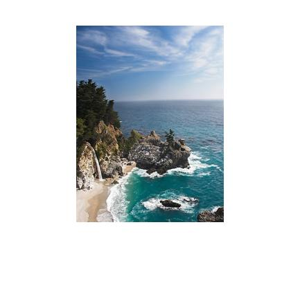
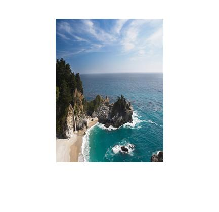
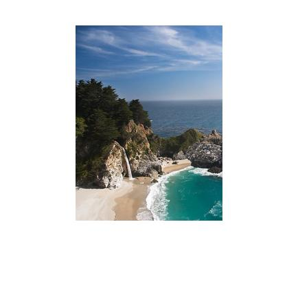
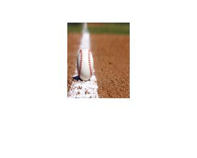

# 鄭敬儒<span style="color:red">_103061240</span>

# Project 3 / Seam Carving for Content-Aware Image Resizing

## Overview
> The goal of this project is implementing Seam Carving. There are five steps to implement Seam Carving and we need to carry out all of them to accomplish this project.
<br>(1). Defining an energy function that would map a pixel into energy value.
<br>(2). Defining the path of pixels (seam), which length is width/height of the image. 
<br>(3). Looking for a seam with the minimum energy among all seams.
<br>(4). Finding optimal order of deleting seams.
<br>(5). Reducing an image by a given mask.


## Implementation
1. Defining an energy function and seam: energyRGB.m (1)(2)
	* energy function: energy = |dI/dx| + |dI/dy|
	* We calculate energy of RGB image (energyRGB) by calculating energy of each channel (energyGrey)

	  ```
	  %energy of RGB image
	  function res = energyRGB(I)
	     res = energyGrey(I(:, :, 1)) + energyGrey(I(:, :, 2)) + energyGrey(I(:, :, 3));
	  end
	  
	  %energy of one channel
	  function res = energyGrey(I)
	     res = abs(imfilter(I, [-1,0,1], 'replicate')) + abs(imfilter(I, [-1;0;1], 'replicate'));
	  end
	  ```
	  
2. Looking for optimal seam with the minimum energy: findOptSeam.m (3)(4)
	* Finding the minimum energy for all possible seam for each (i,j) in M. M is padding in vertical dimension on energy to avoid handling border elements

	  ```
	  %padding in vertical on energy to avoid handling border elements
	  M = padarray(energy, [0 1], realmax('double'));
	  sz = size(M);
	  
	  %finding optimal seam from up to down
	  for row = 2:sz(1)
	      for col = 2:sz(2)-1
	           M(row, col) = M(row, col) + min(M(row - 1, col-1:1:col+1)); %, M(row - 1, col), M(row - 1, col + 1)
	      end
	  end
	  ```	
	
	* Traverse back the path of seam with minimum energy to find the optimal seam mask 
	  ```
	  % Find the minimum element in the last raw of M
	  [val, idx] = min(M(sz(1), :));
	  
	  % Initial for optimal seam mask
	  optSeamMask = zeros(size(energy), 'uint8');
	  
	  % Traverse back the path of seam with minimum energy to update optimal seam mask
	  optSeamMask(sz(1), idx-1) = 1;
	  new_idx = idx;
	  for row_m = sz(1):(-1):2
	      [new_val, tmp] =  min(M(row_m - 1, new_idx:1:new_idx + 2)); 
	      optSeamMask(row_m-1, tmp+new_idx-2) = 1;
	      new_idx = tmp+new_idx-2;
	  end
	  ```

3. Reducing an image by optimal seam mask: reduceImageByMask.m (5)
	* From optimal seam mask, we can know which pixel need to be removed. So we use two part to remove pixel, one is Vertical, the other is Horizontal
	  ```
	  % Vertical
	  function imageReduced = reduceImageByMaskVertical(image, seamMask)
	      [x, y, z] = size(image);
	      imageReduced = zeros(x, y-1, z);
	      
	      for i = 1:x
	          imageReduced(i, :, :) = image(i,seamMask(i,:),:);
	      end
	  end
	 
	  % Horizontal
	  function imageReduced = reduceImageByMaskHorizontal(image, seamMask)
	      [x, y, z] = size(image);
	      imageReduced = zeros(x-1, y, z);
	  
	      for i = 1:y
	          imageReduced(:, i, :) = image(seamMask(:,i),i,:);
	      end
	  end
	  ```


## Installation
* Other required packages. No
* How to compile from source? I download to my laptop and compile on MatLab

### Results
* From left to right are (1).seam caving   (2).scaling   (3).cropping
1. Sea
<table border=1>
<tr>
<td>



</td>
</tr>
	
</table>

2. Baseball
<table border=1>
<tr>
<td>



</td>
</tr>

</table>

