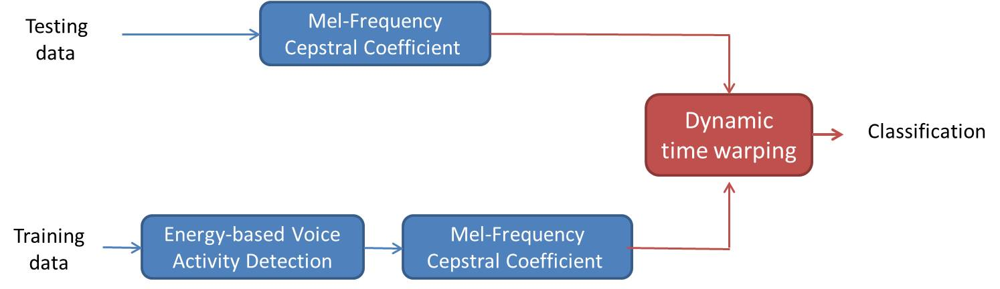

# Project 3: Simple Voice Recoginition 

## Overview
The goal of this assignment is that using MFCC and DTW to implement a voice recoginition to reconginize one to ten. 

## Demo
1. Train: Using *MFC.py* to find all the voice MFCC feature of training data 
2. Test: Using *MFC.py* to find all the voice MFCC feature of testing data
3. Run *DTW.py* to see the accurcy of testing data

## Result
**Flow Chart**

 

